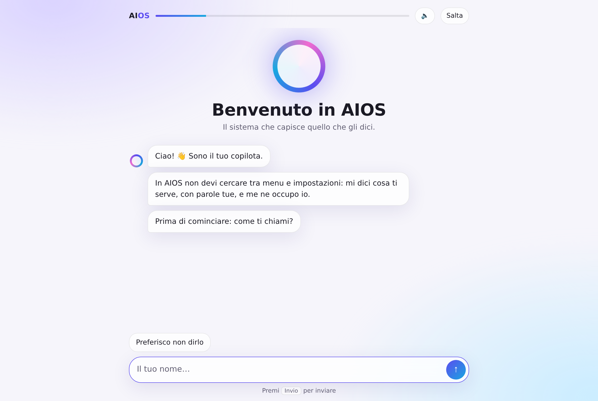
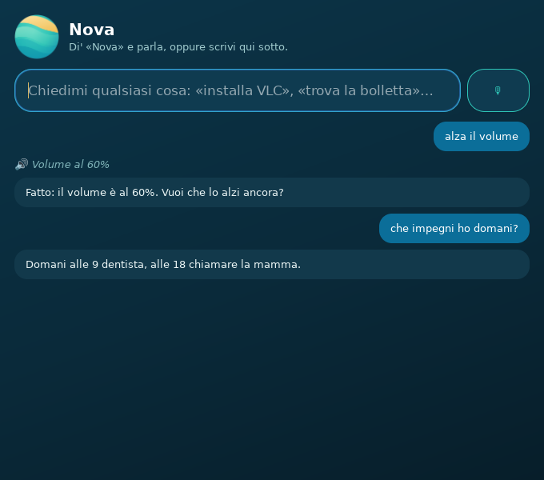
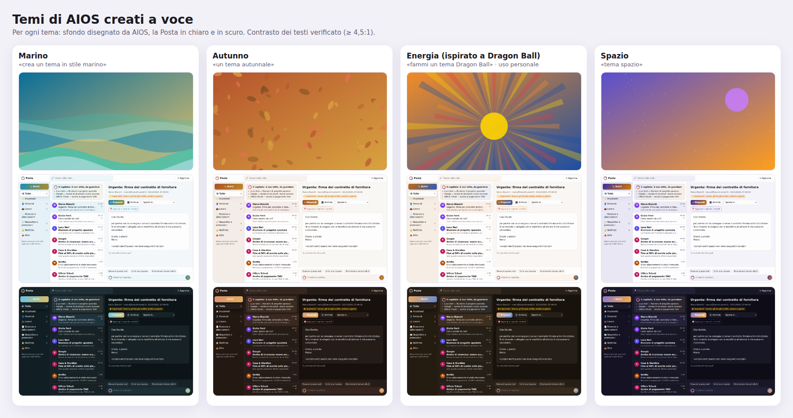
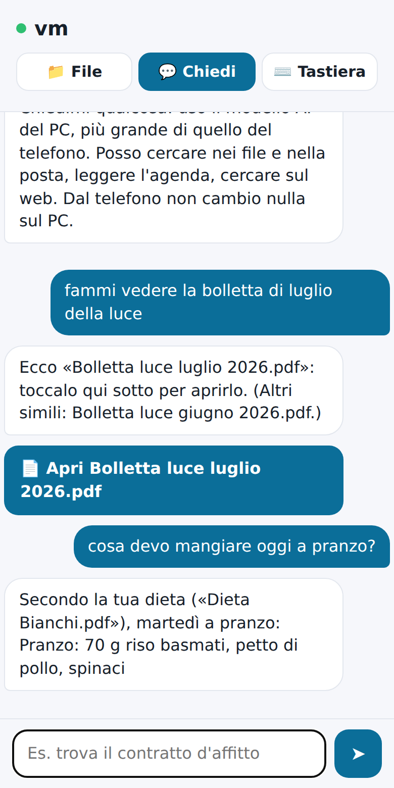
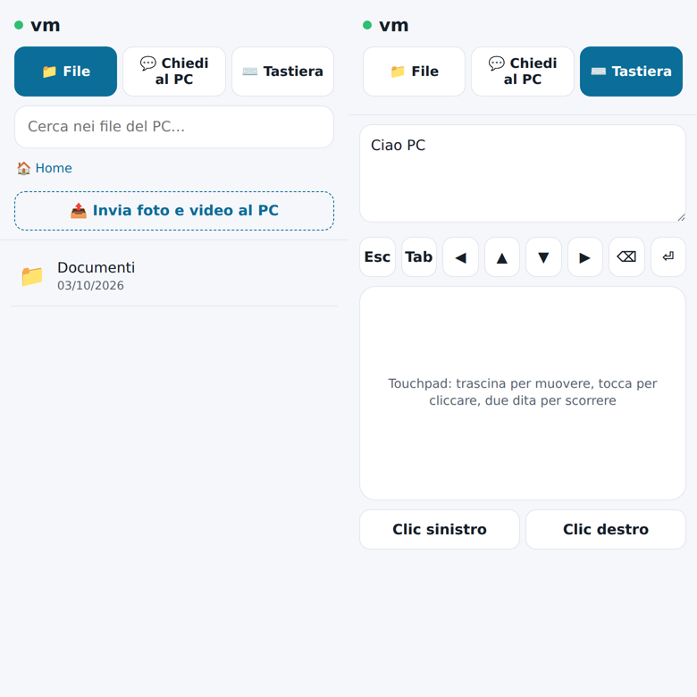
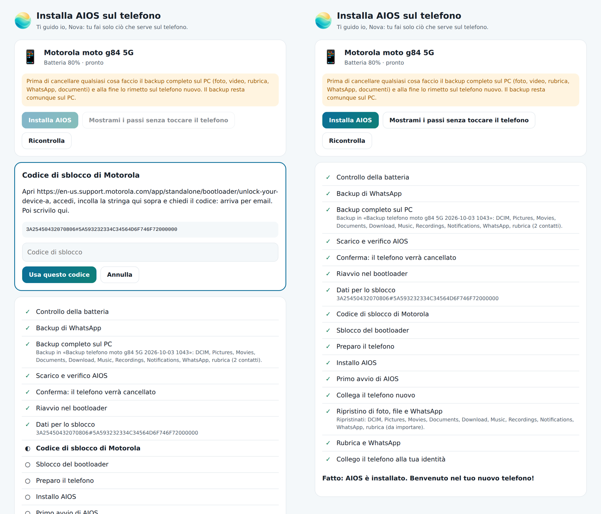

<p align="center"></p>

<p align="center"><b>Il sistema operativo in cui fai tutto parlando con Nova, l'assistente AI locale.</b><br>
Computer, tablet e telefono: lo stesso sistema, collegati tra loro, senza mandare i tuoi dati a nessuno.</p>

<p align="center">
  <a href="#installare-aios-sul-pc">Installa</a> ·
  <a href="#cosa-puoi-chiedere-a-nova">Cosa fa</a> ·
  <a href="#stato-del-progetto">Stato</a> ·
  <a href="docs/ARCHITECTURE.md">Architettura</a> ·
  <a href="docs/SDK.md">SDK per le app</a>
</p>

<p align="center"></p>

<p align="center"></p>

## Perché SoIA

- **Parli, Nova fa.** Di' «Nova» e chiedi a voce, oppure scrivi: installare un programma, trovare
  un documento, rispondere a una mail, cambiare tema. Nova ascolta e risponde a voce, tutto sul
  computer (niente viene registrato o inviato). Niente menu da imparare.
- **Veloce anche senza scheda video.** I comandi comuni sono capiti in microsecondi da un
  motore di intenti e da un classificatore semantico; il modello AI (tramite
  [Ollama](https://ollama.com)) serve solo per il resto, e SoIA sceglie quello adatto al tuo
  computer — compresso o «a esperti» quando la memoria è poca.
- **Privato per davvero.** Nova impara dai tuoi file e dalle tue abitudini, ma tutto resta sul
  dispositivo. Quando qualcosa deve uscire (una ricerca, una mail), lo vedi e lo approvi.
- **I tuoi dispositivi sono uno solo.** Telefono e PC si collegano da soli quando sono vicini, anche
  fuori casa senza Wi-Fi (come iPhone e Mac):
  foto salvate sul PC, chiamate e SMS dal computer, file del PC dal telefono, il telefono che usa
  l'AI del PC. Un'identità unica e la sincronizzazione cifrata end-to-end li tengono allineati.
- **Le tue app, tutte.** Le app Linux girano nativamente, molte app Windows con Wine/Bottles, le
  app Android con Waydroid (sul telefono, nativamente).

## Cosa puoi chiedere a Nova

| Ambito | Esempi |
|---|---|
| Sistema e app | «installa un programma per montare video», «alza il volume», «quanta memoria ho?», «aggiorna il sistema» |
| Documenti | «fammi vedere la bolletta di luglio della luce», «trova il contratto d'affitto», «riordina la scrivania» |
| Agenda | «ricordami di chiamare la mamma domani alle 18», «che impegni ho domani?», «buongiorno» (riepilogo) |
| Posta | «ho nuove mail?», «rispondi a Marco che arrivo alle 9», «archivia le newsletter» |
| Telefono | «salva le foto sul PC», «rispondi» (alla chiamata), «manda un sms a Giulia: arrivo!», «copia il codice» |
| Vita quotidiana | «cosa devo mangiare oggi?» (dalla tua dieta in PDF), «fammi la lista della spesa», «consigliami un film» |
| Aspetto | «crea un tema in stile marino», «fai un tema da questo disegno», «più scuro» |
| AI | «che modelli posso usare?», «ottimizza la memoria», «come gestisci la batteria?» |

Molte di queste frasi sono riconosciute all'istante, senza modello AI.

<table>
<tr>
<td></td>
<td></td>
</tr>
<tr>
<td align="center">Posta organizzata da Nova</td>
<td align="center">Temi creati a voce o da un disegno</td>
</tr>
<tr>
<td></td>
<td></td>
</tr>
<tr>
<td align="center">Dal telefono: la bolletta giusta, la dieta di oggi</td>
<td align="center">Il telefono come tastiera e touchpad del PC</td>
</tr>
</table>

## Installare SoIA sul PC

Oggi SoIA si installa **sopra un Linux esistente** (Fedora, Ubuntu/Debian, Arch, con GNOME o
KDE). L'immagine SoIA completa, installabile da chiavetta, è in [anteprima](#immagine-aios-per-pc-anteprima).

```bash
git clone https://github.com/davidecatellani/aios.git
cd aios
./install.sh
```

Lo script ti chiede conferma prima di usare la password o la rete, e:

1. installa i programmi di sistema che servono (GTK 4, WebKitGTK, ffmpeg, KDE Connect, …);
2. installa Nova e i programmi di SoIA nella tua cartella personale (`~/.local/share/aios`);
3. installa [Ollama](https://ollama.com) e un primo modello AI piccolo (circa 1 GB): poi Nova ti
   propone in automatico modelli migliori adatti al tuo computer;
4. aggiunge Nova al menu, la scorciatoia **Super+Spazio** e il benvenuto al prossimo accesso;
5. attiva i servizi in sottofondo (apprendimento a riposo, agenda, posta, telefono).

**Requisiti:** Linux a 64 bit, Python 3.10+, 8 GB di RAM consigliati (4 GB bastano per i comandi
e un modello piccolo), circa 5 GB liberi. La scheda video non serve.

| Per… | Comando |
|---|---|
| aprire il benvenuto | `aios-welcome` (o dal menu: «Benvenuto in SoIA») |
| parlare con Nova | **Super+Spazio**, oppure `aios-copilot "la tua richiesta"` |
| aggiornare SoIA | `git pull && ./install.sh` |
| togliere SoIA | `./install.sh --disinstalla` (i tuoi dati restano; `--cancella-dati` per toglierli) |
| installare senza domande | `./install.sh --si` |

Dopo l'installazione: installa l'app **KDE Connect** sul telefono (Android o iPhone) e di'
«Nova, collega il telefono».

### Immagine SoIA per PC (anteprima)

Il sistema completo: Fedora Silverblue immutabile con SoIA già dentro, aggiornamenti atomici
preparati a riposo e applicati al riavvio, ritorno automatico alla versione precedente se
qualcosa non va. Si costruisce dal [`Containerfile`](image/Containerfile) e se ne crea anche la
chiavetta d'installazione: vedi [`image/README.md`](image/README.md).

## SoIA sul telefono

SoIA per telefono è basato su **Android open source** (AOSP; LineageOS per i modelli che supporta)
e si installa **dal PC, con il cavo USB**: «Nova, installa SoIA sul telefono» apre un installatore
guidato che fa il backup completo, sblocca, installa e rimette tutto al suo posto.
Pixel, Samsung, Motorola, Xiaomi/Redmi, Oppo (dove la marca lo permette).

<p align="center"></p>

La compilazione dell'immagine è in [`phone/`](phone/README.md) (primo bersaglio: Redmi Note 9 Pro).

## Stato del progetto

SoIA è in sviluppo attivo. Onestamente, ad oggi:

| Parte | Stato |
|---|---|
| Nova sul PC: livelli veloci, modello locale, strumenti, protezione dalle fughe di dati | ✅ funzionante |
| Conoscenza personale: indice dei file, apprendimento a riposo, catalogazione automatica | ✅ |
| Agenda, posta (Gmail, Outlook, IMAP), consigli, abbonamenti, temi e market dei temi | ✅ |
| Modelli AI adatti al dispositivo: catalogo firmato, compressione, modelli a esperti | ✅ |
| Telefono ↔ PC: collegamento, foto, chiamate, SMS, tastiera, documenti, AI del PC | ✅ (con KDE Connect) |
| Telefono ↔ PC senza Wi-Fi: Bluetooth, Wi-Fi diretto, internet del telefono | 🧪 PC provato con test; app del telefono da compilare |
| Identità unica, sincronizzazione cifrata, relay | ✅ |
| Aggiornamenti automatici (rpm-ostree/bootc), batteria gestita da Nova, SDK per le app | ✅ |
| `install.sh` su Linux esistente | ✅ provato su Ubuntu 24.04 |
| Immagine SoIA per PC: shell SoIA (niente desktop classico), Nova a voce, aggiornamenti senza formattare | 🧪 anteprima, in prova su un PC vero |
| Installatore per telefono | 🧪 provato con telefoni simulati |
| Immagine SoIA per telefono | 🛠️ struttura di compilazione pronta, prima compilazione da fare |

Le parti segnate ✅ sono coperte da oltre 300 test automatici. Alcune integrazioni (desktop
reali, modelli veri, telefoni veri, provider di posta) vanno ancora provate sul campo:
le segnalazioni sono benvenute.

## Privacy e sicurezza, in breve

- I modelli AI girano sul tuo dispositivo; i tuoi file, la posta e le abitudini non escono.
- Se il modello prova a mandare fuori dati personali, vedi cosa e decidi tu.
- Le azioni importanti (installare, inviare, cancellare) chiedono sempre conferma.
- Modelli, temi e immagini arrivano da cataloghi firmati e verificati.
- Tra i tuoi dispositivi: chiavi per dispositivo, revoca e sincronizzazione cifrata end-to-end.

## Documentazione

| Documento | Contenuto |
|---|---|
| [`docs/ARCHITECTURE.md`](docs/ARCHITECTURE.md) | architettura, scelte tecniche e roadmap |
| [`docs/DESIGN.md`](docs/DESIGN.md) | interfaccia e integrazione di Nova, con tavole di progetto |
| [`copilot/README.md`](copilot/README.md) | Nova e i programmi di SoIA: tutte le funzioni e i comandi |
| [`docs/SDK.md`](docs/SDK.md) | come una app offre le sue funzioni a Nova |
| [`image/README.md`](image/README.md) | immagine SoIA per PC |
| [`phone/README.md`](phone/README.md) | immagine SoIA per telefono |
| [`docs/BRAND.md`](docs/BRAND.md) | marchio, loghi e regole d'uso |

## Sviluppo

```bash
cd copilot
pip install -e . pytest
AIOS_OLLAMA_URL=http://127.0.0.1:9 pytest -q    # i test non richiedono un modello AI
```

Struttura: `copilot/` (Nova e i servizi, Python, nessuna dipendenza esterna), `image/` (immagine
per PC), `phone/` (immagine per telefono e app Nova per Android), `docs/` (documentazione e
marchio). I test girano su GitHub a ogni modifica.

## Licenza

SoIA è software libero: puoi usarlo, studiarlo, modificarlo e ridistribuirlo secondo la
[GNU General Public License, versione 3 o successive](LICENSE) (GPL-3.0-or-later). Chi distribuisce
versioni modificate deve renderne disponibile il codice sorgente con la stessa licenza.

I loghi di SoIA e di Nova ([`docs/brand/`](docs/brand/)) identificano il progetto: per usarli in
versioni modificate o in altri prodotti, chiedi prima.
