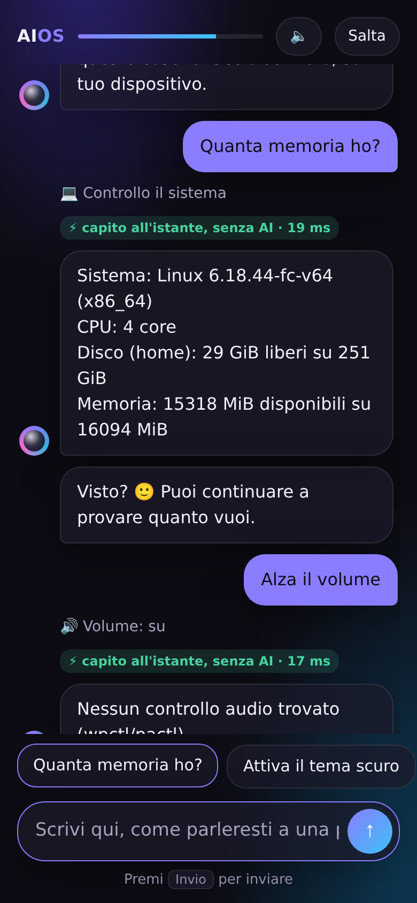

# AIOS Copilot

L'assistente AI locale di AIOS. È pensato per essere veloce anche **senza GPU**:

1. i comandi comuni ("apri Firefox", "installa VLC", "apri i Download", "cerca …")
   vengono capiti dal **motore di intenti** in circa 10 µs, senza usare il modello AI;
2. le frasi riformulate ("si sente troppo piano", "stacca il wifi", "fammi vedere le
   mie foto") vengono riconosciute dal **classificatore semantico** in ~0,3 ms
   (italiano e inglese; le altre lingue con un modello di embedding multilingue,
   vedi sotto);
3. tutto il resto va a un modello linguistico piccolo in esecuzione sul tuo computer
   (tramite [Ollama](https://ollama.com)), tenuto sempre in memoria e preparato
   all'avvio.

Dettagli in [`docs/ARCHITECTURE.md`](../docs/ARCHITECTURE.md#motore-ai-veloce-anche-senza-gpu).

| Strumento | Cosa fa | Chiede conferma |
|---|---|---|
| `search_web`, `read_webpage` | cerca su internet e legge le pagine | no |
| `search_apps` | cerca app su Flathub e nei pacchetti di sistema | no |
| `install_app`, `remove_app` | installa/disinstalla (Flatpak, oppure apt tramite polkit) | **sì** |
| `launch_app` | apre un'applicazione | no |
| `open_location` | apre file, cartelle e siti | no |
| `system_info` | CPU, memoria, disco | no |
| `set_volume`, `set_brightness`, `set_theme`, `set_radio` | audio, luminosità, tema scuro/chiaro, Wi-Fi e Bluetooth | no |
| `media_control`, `take_screenshot`, `lock_screen` | musica, screenshot, blocco schermo | no |
| `power` | sospensione, spegnimento, riavvio | **sì** |
| `search_files`, `read_file` | cerca e legge i tuoi documenti (indice locale) | no |
| `exclude_folder` | «non leggere questa cartella» | no |
| `add_reminder`, `add_event`, `list_agenda`, `daily_briefing` | promemoria, appuntamenti, agenda, riepilogo | no |
| `complete_reminder`, `resolve_suggestion` | segna come fatto, accetta/ignora scadenze trovate | no |
| `delete_agenda_item` | elimina dall'agenda | **sì** |

## Prova

```bash
# 1. Modello locale con supporto agli strumenti (piccolo: va bene anche senza GPU)
ollama pull qwen2.5:1.5b-instruct

# 2. Interfaccia grafica GTK4 (Debian/Ubuntu; su Fedora: python3-gobject gtk4)
sudo apt install python3-gi gir1.2-gtk-4.0

# 3. Copilota
cd copilot && pip install -e .
aios-copilot                               # finestra grafica
aios-copilot "installa un lettore video"   # oppure dal terminale
```

### Agenda e promemoria

Si parla come a una persona, e le frasi d'agenda vengono capite all'istante, senza
modello AI:

- «ricordami di chiamare la mamma domani alle 18», «tra 20 minuti ricordami di togliere la pasta»
- «ricordami di prendere la pillola ogni giorno alle 8», «tutti i martedì alle 21 la spazzatura»
- «ho la visita medica il 3 novembre alle 11», «cena da Luca sabato sera», «compleanno di Anna il primo dicembre»
- «che impegni ho domani?», «i miei promemoria», «fatto: comprare il latte», «cancella l'appuntamento dal dentista»
- «buongiorno» → riepilogo della giornata

Gli avvisi arrivano come notifiche del desktop: il giorno prima e un'ora prima per gli
appuntamenti, all'ora giusta per i promemoria. Se il computer era spento o in standby,
gli avvisi delle ultime 6 ore vengono recuperati al risveglio. Ogni mattina, dalle 8 (o
alla prima accensione dopo, entro mezzogiorno), arriva il **riepilogo**: impegni di oggi,
cose rimaste indietro, da fare, anteprima di domani, file su cui stavi lavorando, e
**scadenze trovate nei tuoi documenti** («da pagare entro il 15/11»). Queste sono solo
proposte: entrano in agenda solo se dici «aggiungi la scadenza 1».

```bash
aios-agenda oggi | domani | settimana | riepilogo
aios-agenda esporta agenda.ics    # verso qualsiasi calendario
aios-agenda importa calendario.ics
systemctl --user enable --now aios-agenda   # dopo aver copiato data/aios-agenda.service
```

### Posta

Un client email nativo con il copilota dentro: Gmail, Outlook, Yahoo, iCloud,
Libero, Virgilio o qualsiasi server IMAP/SMTP.

```bash
aios-mail aggiungi tuo@gmail.com          # password per le app (Gmail, Yahoo, iCloud...)
aios-mail aggiungi tuo@outlook.com        # Outlook: accesso con Microsoft (OAuth)
aios-posta                                # apre la Posta
aios-mail archivia newsletter             # archiviazione automatica di una categoria
systemctl --user enable --now aios-mail   # servizio (dopo aver copiato data/aios-mail.service)
```

- **Catalogazione automatica** in locale: Importanti, Personali, Lavoro, Ricevute e
  abbonamenti, Newsletter e promozioni, Notifiche. «Sposta in…» corregge la categoria
  di quel mittente anche per il futuro.
- **Notifiche solo delle mail importanti** (persone a cui scrivi, urgenze, accessi
  sospetti), mai delle promozioni, mai due volte.
- **Archiviazione automatica** solo delle categorie scelte, solo posta letta e più
  vecchia di una settimana: la mail viene spostata in «AIOS/…», mai cancellata; se
  il server non permette di spostarla in sicurezza, resta dov'è.
- Le mail si scaricano senza segnarle come lette; si leggono come testo (nessun
  codice o immagine remota eseguiti); le date trovate diventano «Aggiungi in agenda».
- **Il copilota sa quale mail stai leggendo**: «ricordamelo domani alle 9»,
  «riassumi questa mail», «scrivi una risposta». Le mail sono dati, mai ordini: una
  mail che chiede di «inoltrare tutto» non fa partire nulla senza la tua conferma,
  che mostra destinatario e testo.
- Gmail e Outlook con OAuth richiedono un client id di AIOS registrato presso
  Google/Microsoft (`~/.config/aios/oauth.json`).

| PC | Telefono |
|---|---|
|  |  |

### Abbonamenti e consigli

- «i miei abbonamenti», «quanto spendo in abbonamenti?»: riconosciuti da ricevute,
  rinnovi e disdette nelle email, dalle app installate, o dichiarati («ho Netflix e
  Spotify», «ho disdetto Disney+»). I rinnovi diventano proposte nel riepilogo.
- «consigliami un film», «che cartone guardiamo con i bambini?», «suggeriscimi un
  gioco»: scelti in locale tra i titoli **inclusi nei tuoi abbonamenti** o gratuiti.
  «Mi è piaciuto …» / «… non mi è piaciuto» affinano i gusti.
- I cataloghi (TMDB per film e serie, Flathub per app e giochi) si scaricano con
  richieste uguali per tutti: gusti e abbonamenti non escono dal dispositivo. Per
  film e serie serve una chiave TMDB gratuita (`AIOS_TMDB_KEY`). La musica è il
  prossimo passo.

### Modelli AI adatti al tuo dispositivo

AIOS legge memoria, processore (AVX2, core), GPU (NVIDIA, AMD, Intel), NPU e spazio
libero, e propone per ogni capacità il modello gratuito più completo che ci sta
davvero, lasciando sempre memoria al resto del sistema:

| Capacità | Modelli (dal più leggero) | Diventa nel sistema |
|---|---|---|
| testo | Qwen2.5 0,5B → 32B | il modello del copilota |
| vista | Moondream, Qwen2.5-VL 3B/7B, Llama 3.2 Vision | «cosa c'è in questa foto?», «cosa c'è sullo schermo?» |
| dettatura | Whisper base/small/large-v3-turbo | trascrizione di audio e messaggi vocali |
| voce | Piper (voce italiana) | lettura ad alta voce |
| significato | Granite, paraphrase-multilingual, BGE-M3 | livello 1 in tutte le lingue (calibrato da solo) e ricerca nei file |
| immagini | SD-Turbo, SDXL-Turbo | «crea un'immagine di…» |
| video | — | proposto solo con GPU da almeno 16 GB |

«che modelli posso usare?» mostra le proposte; «aggiorna i modelli» o «installa la
vista» (con conferma) li mette in coda: si scaricano a riposo e in carica, a passi
riprendibili, e appena pronti vengono **collegati al sistema** da soli. Le funzioni
compaiono al copilota solo quando modello e programma (whisper.cpp, piper,
stable-diffusion.cpp, presenti nell'immagine di AIOS) ci sono davvero. Una volta a
settimana, se c'è di meglio, il riepilogo del mattino lo segnala.

```bash
aios-modelli proposte | installa [vista dettatura …] | stato | ripristina testo | solo-aperte
aios-catalogo stato | aggiorna         # catalogo dei modelli firmato
aios-memoria stato | configura         # RAM compressa e memoria del modello compressa
```

**Memoria compressa.** Il catalogo ha varianti dei modelli compresse a 3 e 2 bit:
su una GPU da 12 GB entra un modello da 14 miliardi di parametri, su una da 24 GB uno
da 32. Se una variante, provata sul tuo dispositivo, è lenta o imprecisa, AIOS la
scarta e prova da solo la successiva. «ottimizza la memoria» (con conferma e password)
attiva la RAM compressa (zram + zstd) e comprime la memoria della conversazione del
modello a 8 o 4 bit; «quanta memoria ho» mostra quanto si risparmia.

L'elenco dei modelli si aggiorna con un **catalogo firmato** dal progetto AIOS: i
modelli nuovi arrivano senza aggiornare il codice. Prima di adottare un nuovo
modello di testo, AIOS lo **prova sul tuo dispositivo** (velocità e precisione sui
compiti del copilota) e lo tiene solo se va meglio; altrimenti lo scarta.

### Tutto in ordine, senza creare cartelle

AIOS cataloga da solo **tutto** quello che hai su Scrivania, Download, Documenti,
Immagini, Video e Musica, più le app installate:

| Cosa | Come lo ordina |
|---|---|
| documenti | per argomento (Fatture e ricevute, Contratti, Casa, Salute, Banca e tasse, Auto, Viaggi, Lavoro, Scuola e studio…) e anno |
| foto | per momento (data di scatto EXIF: «14–15 agosto 2026»); screenshot a parte |
| video | per mese; registrazioni dello schermo a parte |
| musica | per artista e album (tag ID3/FLAC o «Artista - Titolo») |
| app e giochi | per uso (Giochi, Ufficio, Grafica…), con le app Windows e Android segnalate |
| download | installer, archivi, scaricamenti interrotti, duplicati |

**Di default non sposta niente**: le raccolte si vedono chiedendo al copilota
(«le mie raccolte», «mostrami le fatture del 2025», «foto di agosto», «che giochi
ho?») e nella cartella **~/Raccolte**, fatta di collegamenti ai file originali.
«Riordina la scrivania» prepara un piano e lo mostra; «procedi con il riordino» lo
esegue; «annulla il riordino» riporta ogni file dov'era. «Cosa posso eliminare?»
propone duplicati, installer vecchi e scaricamenti interrotti, senza cancellare
nulla. Mai toccati: file nascosti, cartelle di progetti (con `.git`), cartelle
escluse.

### Temi creati a voce

«Crea un tema in stile marino», «un tema autunnale», «fammi un tema Dragon Ball»,
«alto contrasto per mia nonna», «crea un tema partendo da questo disegno
~/Immagini/disegno.png», poi «più scuro», «più caldo», «più vivace»… e «torna al
tema di prima».


- Il tema cambia colori (chiari e scuri), accento, forme, carattere e sfondo di
  GNOME/KDE, delle app GTK e delle app di AIOS. Nei file GTK occupa solo un blocco
  tra marcatori: le tue personalizzazioni restano.
- **Leggibilità garantita**: ogni coppia testo/sfondo rispetta il contrasto WCAG
  (≥ 4,5:1, ≥ 7:1 per «alto contrasto») e viene corretta se serve.
- Da un disegno: colori principali estratti in locale (ffmpeg + k-means), il disegno
  diventa lo sfondo. Da una descrizione: atmosfere conosciute subito, le altre con una
  palette proposta dal modello e controllata. Sfondi disegnati da AIOS (onde,
  montagne, stelle, energia, foglie…), senza file esterni.
- **Market**: indice firmato (stesse chiavi del catalogo dei modelli), pacchetti con
  impronta SHA-256 che possono contenere **solo** `theme.json` e un'immagine: niente
  codice, niente SVG, niente percorsi strani. I temi ispirati a opere o marchi restano
  per uso personale e non si possono pubblicare.

### I tuoi file e l'apprendimento a riposo

Il copilota cerca e legge i tuoi documenti (testi, PDF, Word, LibreOffice) tramite
un indice locale: «cerca nei miei file il preventivo del bagno», «dov'è il
documento del contratto». L'indice e l'apprendimento lavorano **quando non usi il
computer** (inattivo o schermo bloccato), solo se è collegato alla corrente, con la
priorità più bassa del sistema; appena torni si fermano, e riprendono più tardi da
dove erano arrivati. Durante lo standby il processore è fermo: il lavoro resta
congelato e riparte al risveglio, dopo una pausa.

```bash
aios-learn --now      # costruisce subito l'indice, senza aspettare il riposo
aios-learn --status   # a che punto è, e quali frasi ha imparato
aios-learn --forget   # cancella frasi imparate e cronologia
systemctl --user enable --now aios-learn   # dopo aver copiato data/aios-learn.service
```

Cosa impara: l'indice dei file; il significato dei documenti (se è configurato un
modello di embedding); **le tue frasi**: quando il modello AI risolve una richiesta
con una sola azione riuscita, e la stessa frase porta due volte alla stessa azione,
dalla volta dopo il copilota la esegue all'istante.

**Privacy.** Non vengono mai letti chiavi e password (`~/.ssh`, `~/.gnupg`, `.env`,
`*.kdbx`…), profili dei browser e posta; i segreti dentro i documenti (password,
token, numeri di carta, IBAN) vengono rimossi dall'indice. «Non leggere la cartella
Lavoro» la esclude e la toglie subito dall'indice. Se in una conversazione il
copilota ha letto i tuoi file e poi il modello vuole inviare qualcosa su internet,
l'azione si ferma e ti mostra cosa uscirebbe, evidenziando i dati presi dai tuoi file.
I contenuti di pagine web e documenti vengono passati al modello come dati, mai come
istruzioni. Indice e cronologia sono leggibili solo dal tuo utente (permessi 600);
la cifratura vera è quella del disco, prevista nell'immagine di AIOS.

### Benvenuto

Al primo accesso AIOS si presenta con una conversazione: il copilota chiede come ti
chiami, spiega il sistema con parole semplici (come parlargli, privacy, app,
dispositivi, funzionamento offline) e ti fa provare subito comandi veri, mostrando
quando una richiesta è stata capita all'istante senza modello AI.

```bash
aios-welcome               # finestra dedicata (WebKitGTK) o browser
aios-welcome --first-run   # per l'avvio automatico: non fa nulla se già completato
```

Per l'avvio automatico al primo accesso copia `data/org.aios.Welcome-autostart.desktop`
in `/etc/xdg/autostart/`. La pagina parla con l'agente tramite un server solo
locale (127.0.0.1) protetto da una chiave casuale e dal controllo dell'header Host:
un sito web aperto nel browser non può usarlo per comandare il computer.

| PC (tema chiaro) | Telefono (tema scuro) |
|---|---|
|  |  |

### Tutte le lingue (facoltativo)

Il riconoscimento veloce integrato capisce italiano e inglese. Per le altre lingue
basta un comando, che scarica i modelli di embedding multilingue candidati, li
prova sulle frasi di prova (in spagnolo, francese, tedesco, portoghese, russo e
cinese) e salva il migliore:

```bash
aios-copilot-setup --pull                      # ~1–2 GB di download in tutto
aios-copilot-setup --translate es,fr,de,pt     # opzionale: catalogo tradotto dall'LLM, più preciso
aios-copilot-setup --status
```

Il modello viene scelto con regole prudenti: **nessuna frase fuori tema eseguita**
e precisione di almeno il 97%. Le soglie sono calibrate su metà delle frasi e la
precisione riportata è misurata sull'altra metà. Se nessun modello è abbastanza
affidabile resta attivo solo il classificatore integrato, e le altre lingue
continuano a passare dal modello AI.

**Richiamarlo con un tasto:** nelle impostazioni della tastiera del tuo desktop
aggiungi una scorciatoia personalizzata `Super+Spazio` → `aios-copilot`. Se la
finestra è già aperta, torna in primo piano. `Esc` la nasconde.

### Configurazione

| Variabile | Default | |
|---|---|---|
| `AIOS_MODEL` | `qwen2.5:1.5b-instruct` | qualsiasi modello Ollama con tool calling; su PC potenti ad es. `qwen2.5:7b-instruct` |
| `AIOS_OLLAMA_URL` | `http://localhost:11434` | anche un altro PC di casa |
| `AIOS_SEARXNG_URL` | *(vuoto → DuckDuckGo)* | istanza [SearXNG](https://docs.searxng.org) per ricerche private |

## Test

```bash
pip install -e '.[test]' && pytest
python tests/semantic_eval.py          # qualità del livello 1
python -m aios_copilot.semantic        # prova interattiva del livello 1 (italiano/inglese)
```
