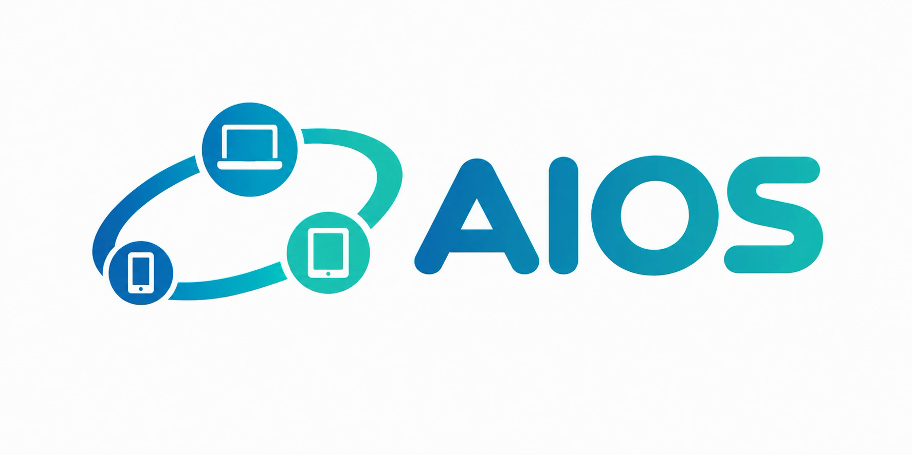
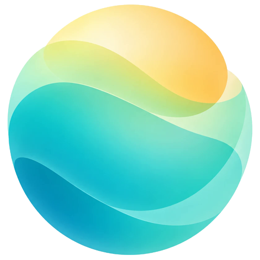
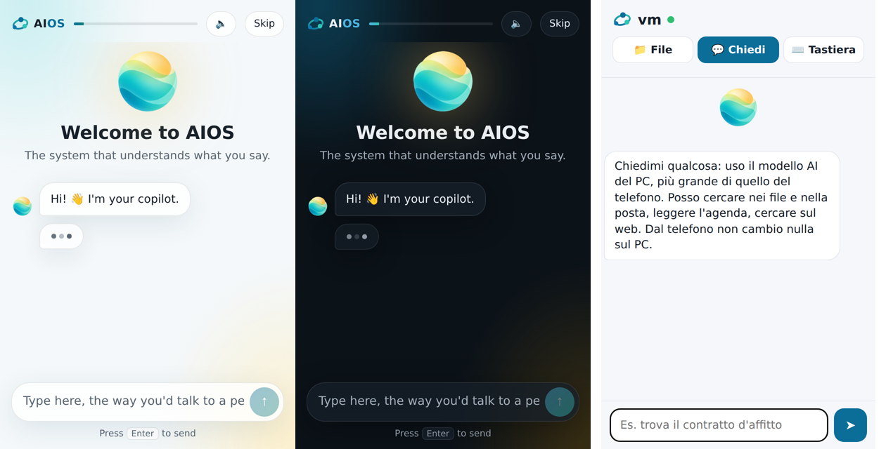

# Marchio

Il sistema si chiama **SoIA**; l'assistente AI si chiama **Nova** («Ehi Nova, …»).

## I loghi scelti

| | File | Uso |
|---|---|---|
|  | `brand/aios-logo.png` | logo completo del sistema (documentazione, sito, schermata d'avvio) |
|  | `brand/aios-simbolo.svg` (+ `.png`) | simbolo del sistema, vettoriale, da 64 px in su (icone grandi, app store, stampa) |
|  | `brand/aios-piccolo.svg` | simbolo semplificato per 16–48 px: a quelle misure i disegni di telefono, tablet e PC si perderebbero |
|  | `brand/copilota.png` (+ `copilota.svg` vettoriale) | **Nova**, l'assistente: si legge bene anche a 16 px; nelle pagine «respira», più veloce quando lavora |

Note sui vettoriali: il simbolo SVG è ripulito (tolto un arco doppio); la sfera SVG
ha l'ambra piena (semitrasparente virava al verde). La scritta «SoIA» del logo
completo è ancora testo che dipende dai caratteri installati: per una versione
definitiva serve la scritta **convertita in tracciati** («outline»), con il carattere
arrotondato del PNG.

Regole d'uso:
- colori del marchio: blu profondo `#0B6E99`, turchese `#2EC4B6`, ambra `#E9C46A`
  (sono anche il tema predefinito di SoIA); su fondo chiaro per i testi si usa il
  turchese scurito `#0F8077`, per il contrasto;
- il simbolo e la sfera non si deformano, non si ruotano e non si mettono su fondi
  che ne coprano i colori; attorno lasciare almeno un quarto della loro larghezza;
- icone di sistema: `copilot/data/icons/hicolor/` (`org.aios.Copilot`, `org.aios.Welcome`).

# Prompt per i loghi di SoIA

Prompt pronti per un generatore di immagini (ChatGPT, Midjourney, ecc.). L'idea visiva: **SoIA** (anagramma di
AIOS; con la I maiuscola si legge «IA») è un **germoglio di soia**: un seme che cresce con chi lo usa, come il
sistema che si personalizza e si riprogramma su misura. **Nova**, l'assistente, resta la sfera luminosa calda.
Colori: blu profondo #0B6E99, turchese #2EC4B6, ambra calda #E9C46A, blu notte #0A2A3A.

Consigli: allega al generatore la sfera di Nova (`brand/copilota.png`) perché lo stile sia coerente; chiedi
sempre sfondo trasparente o bianco e stile vettoriale piatto; controlla il simbolo a 16×16 e a 512×512 pixel.
La scritta va controllata lettera per lettera: «SoIA» con S, I, A maiuscole e la o minuscola.

1. **Logo completo (simbolo + scritta)**
   > Logo vettoriale piatto per un sistema operativo chiamato "SoIA". Simbolo a sinistra: un germoglio di soia
   > stilizzato, un piccolo seme tondo da cui nascono due foglioline morbide e arrotondate che si aprono verso
   > l'alto come due mani; la curva del gambo e delle foglie forma un arco fluido, quasi un'orbita. Il seme è
   > una piccola sfera luminosa ambra #E9C46A, le foglie in gradiente dal blu profondo #0B6E99 al turchese
   > #2EC4B6. A destra la scritta esatta "SoIA" (S maiuscola, o minuscola, I e A maiuscole) in un sans-serif
   > moderno e arrotondato, peso semibold: "So" in blu profondo #0B6E99 e "IA" in turchese #2EC4B6. Linee
   > pulite, nessun dettaglio fotografico, niente ombre, ben leggibile in piccolo. Sfondo bianco.

2. **Solo il simbolo (icone grandi, 64–512 px)**
   > Lo stesso simbolo del germoglio di soia, da solo e centrato, senza scritte: seme tondo ambra #E9C46A con
   > un leggero bagliore e due foglioline arrotondate in gradiente #0B6E99 → #2EC4B6. Proporzioni quadrate,
   > margine generoso attorno, stile vettoriale piatto, sfondo trasparente.

3. **Simbolo piccolo (16–48 px)**
   > Versione semplificatissima del germoglio per favicon e icone di sistema da 16 a 48 pixel: solo un cerchio
   > pieno ambra #E9C46A e due foglie piene turchesi #2EC4B6, forme grandi e spesse, nessuna sfumatura, nessun
   > dettaglio sottile. Sfondo trasparente.

4. **Icona d'app (quadrato arrotondato)**
   > Icona d'app moderna, quadrato con angoli molto arrotondati, fondo blu notte #0A2A3A: al centro il
   > germoglio di soia con il seme ambra #E9C46A che emette una luce morbida e le due foglioline turchesi
   > #2EC4B6. Nessuna scritta. Profondità leggera, pulita e premium, nello stile delle icone di sistema del 2026.

5. **Per la schermata di avvio (fondo scuro)**
   > Il logo completo di "SoIA" (germoglio + scritta "SoIA") in versione per fondo scuro: foglie e scritta
   > bianche, solo il seme resta ambra #E9C46A con un bagliore sottile. Sfondo trasparente, stile piatto,
   > proporzioni orizzontali 3:1.

6. **Monocromatico**
   > Lo stesso logo di "SoIA" (germoglio + scritta) in un solo colore, nero pieno su sfondo bianco, senza
   > sfumature, adatto a stampa e timbri; poi la stessa versione in bianco su sfondo nero.

7. **Tavola coordinata con Nova** (allega `brand/copilota.png`)
   > Crea una tavola di identità visiva per il sistema operativo "SoIA" e la sua assistente AI "Nova". Logo di
   > SoIA: il germoglio di soia con il seme ambra e le foglie blu-turchese, con la scritta "SoIA" ("So" blu,
   > "IA" turchese). Logo di Nova: la sfera luminosa dell'immagine allegata, da non modificare. Palette
   > #0B6E99, #2EC4B6, #E9C46A, #0A2A3A, bianco; carattere sans-serif arrotondato; esempi d'uso: icona d'app,
   > schermata di avvio scura con il logo al centro, favicon, barra in alto con la scritta piccola. Stile
   > piatto, pulito, premium, su fondo chiaro.
