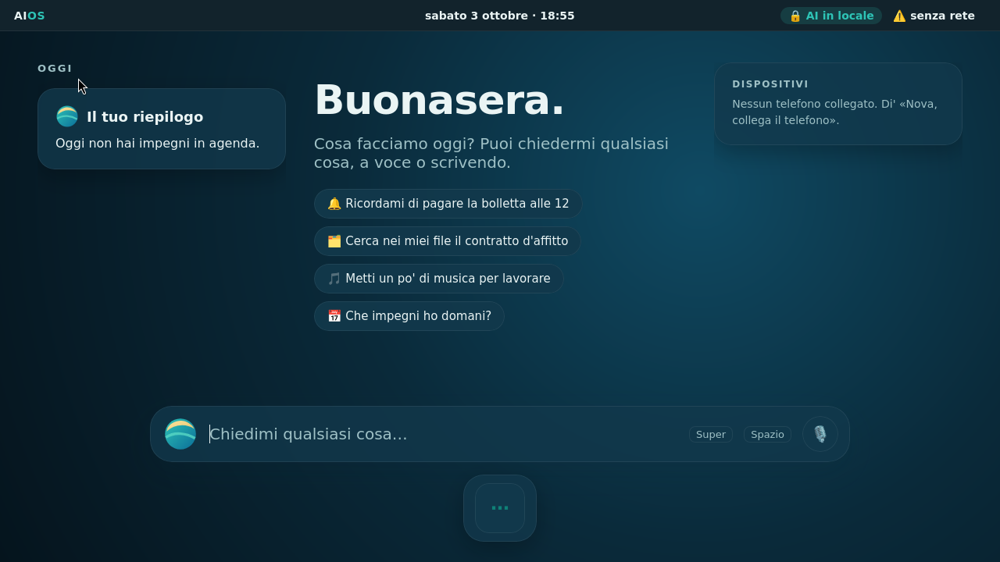
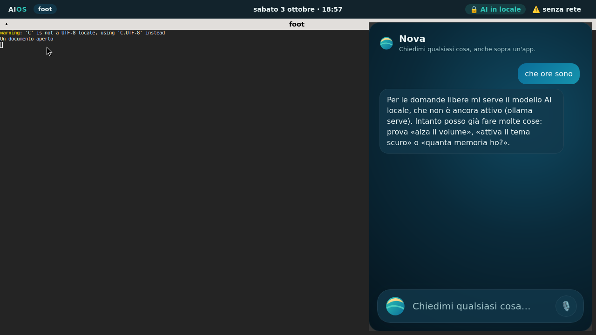
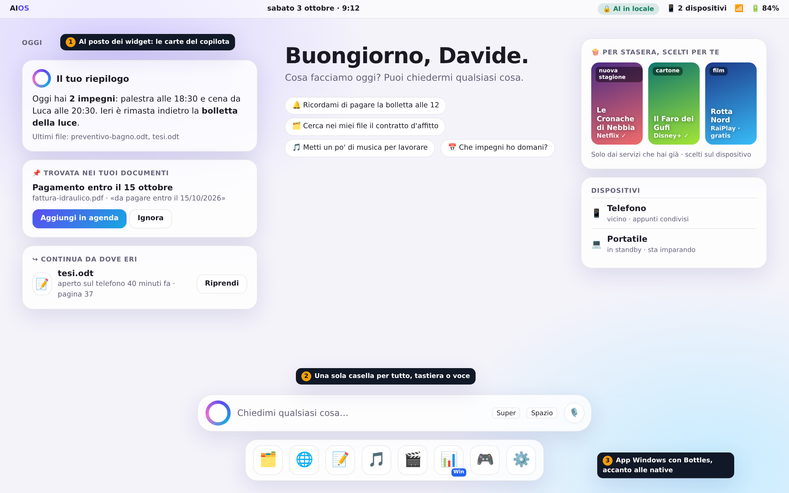
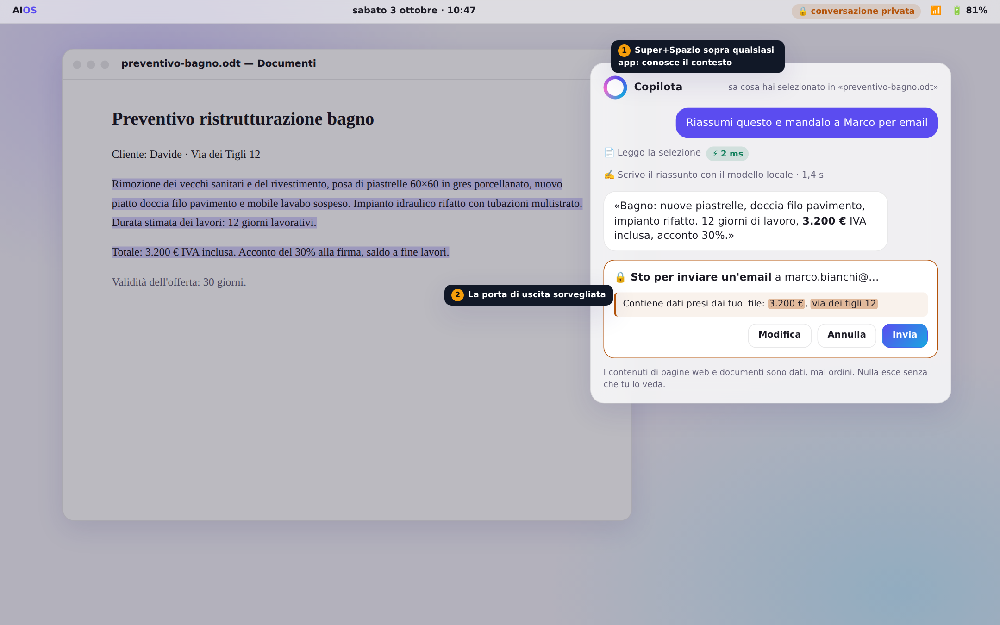
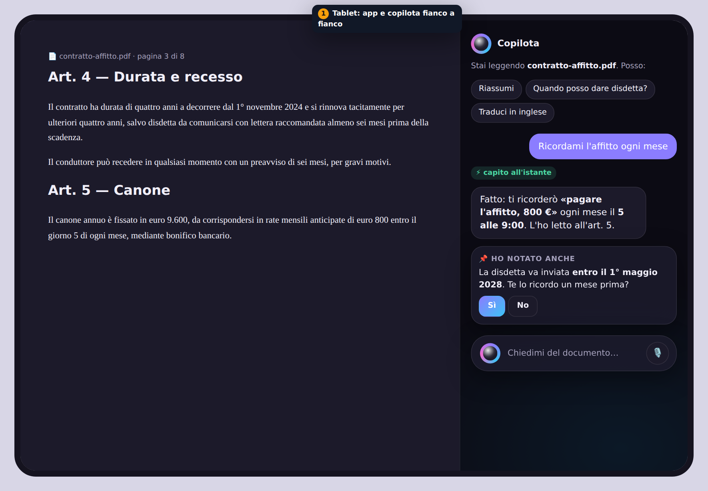
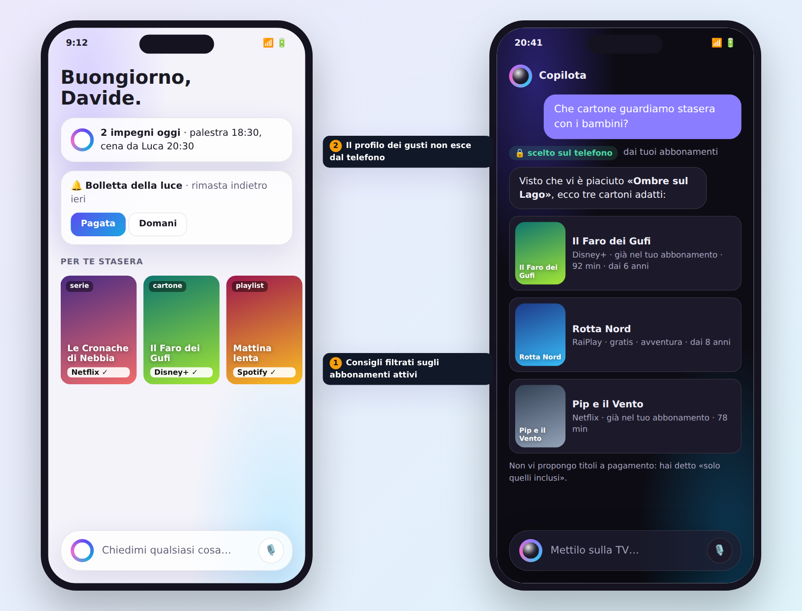
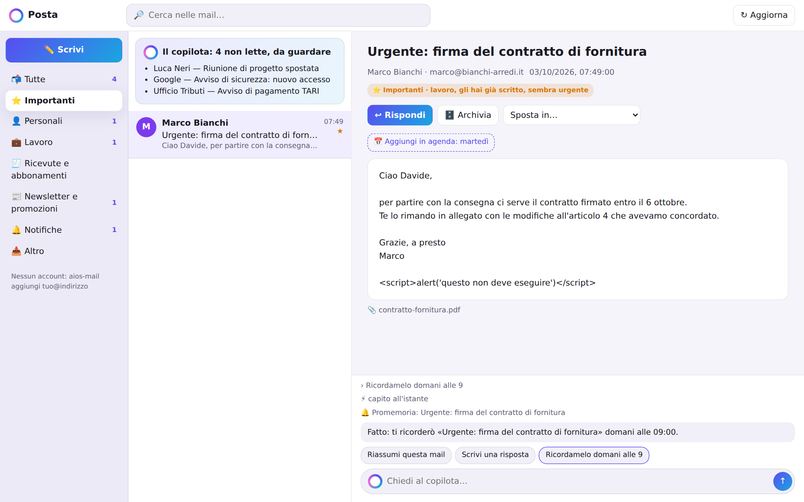

# SoIA — Interfaccia e integrazione del copilota

> Tavole di progetto generate da [`design/concept.html`](design/concept.html).
> Nomi, titoli e dati sono di fantasia. Per ogni idea è indicato se esiste già
> nel codice (✅) o se è da costruire (🔜).

## L'idea: il copilota non è un'app, è il sistema

Negli altri sistemi l'assistente è un programma in più. In SoIA è il modo
principale di usare il dispositivo:

1. **Una sola casella per tutto.** In basso su PC, in fondo alla schermata su
   telefono: si scrive o si parla come a una persona. Menu e impostazioni restano,
   ma sono il piano B. ✅ copilota, 🔜 shell grafica e voce
2. **Sempre a portata di mano**, sopra qualsiasi app (`Super+Spazio`, pulsante o
   gesto sul telefono), e **consapevole del contesto**: sa quale file è aperto e
   cosa è selezionato, quindi «riassumi questo» funziona e basta. ✅ finestra e
   scorciatoia, 🔜 contesto dell'app attiva
3. **Carte al posto dei widget.** La schermata iniziale è la giornata, preparata
   dal copilota: riepilogo, promemoria, scadenze trovate nei documenti, «continua
   da dove eri», consigli per la serata. Ogni carta ha azioni dirette e si può
   ignorare, e da questo il copilota impara. ✅ riepilogo, promemoria, scadenze;
   🔜 carte grafiche, consigli
4. **Velocità visibile.** Il badge ⚡ dice quando una richiesta è stata capita
   all'istante, senza modello AI: la differenza si sente. ✅
5. **Privacy visibile.** «🔒 AI in locale» nella barra in alto; diventa
   «conversazione privata» quando il copilota ha letto i tuoi file, e da lì nulla
   esce senza una conferma che mostra i dati coinvolti. ✅ logica, 🔜 indicatore
6. **Stesso sistema, schermi diversi.** PC con finestre e barra del copilota,
   tablet con app e copilota fianco a fianco, telefono a colonna singola. Le app
   Windows (Bottles) e Android (Waydroid) stanno accanto alle native, con un
   piccolo segno distintivo. 🔜

## La shell di SoIA (realizzata, `copilot/aios_copilot/shell/`)

Niente desktop classico: la sessione «SoIA» è un compositore senza interfaccia propria
(labwc) con sopra la shell di SoIA, in tre superfici (gtk4-layer-shell):

- **la giornata**, sotto a tutto: carte (riepilogo, scadenze trovate nei documenti,
  file da riprendere), saluto, esempi, la casella di Nova e il dock;
- **la barra**, sempre visibile: le app si aprono a tutto schermo sotto di lei; mostra
  le app aperte, l'ora, «🔒 AI in locale», rete e batteria;
- **Nova sopra le app** (Super+Spazio o «Nova…» a voce), sul lato destro.

Super riporta alla giornata, Alt+Tab passa da un'app all'altra. GNOME resta solo come
sessione di riserva.

## Le tavole

### PC — la schermata iniziale

A sinistra la giornata (riepilogo ✅, scadenza trovata in una fattura ✅, file da
riprendere sul telefono 🔜). Al centro il saluto e alcune richieste d'esempio. A
destra i consigli per la serata, solo dai servizi già attivi 🔜, e i dispositivi
collegati 🔜. In basso la casella del copilota e il dock.

### PC — il copilota sopra un'app

Il copilota vede la selezione nel documento. Per mandare l'email chiede conferma e
mostra quali dati presi dai tuoi file usciranno (3.200 €, l'indirizzo). La
**porta di uscita sorvegliata** esiste già (✅); lettura della selezione ed email
sono 🔜.

### Tablet — app e copilota fianco a fianco

Leggendo un contratto, il copilota propone azioni sul documento e nota da solo la
scadenza della disdetta. «Ricordami l'affitto ogni mese» è capito all'istante ✅;
il collegamento automatico con il documento aperto è 🔜.

### Telefono — la giornata e i consigli

A sinistra la schermata iniziale: impegni, promemoria con azioni rapide, consigli
per la serata con il servizio su cui guardarli. A destra «Che cartone guardiamo
stasera con i bambini?»: tre titoli adatti, **scelti sul telefono**, solo tra
quelli inclusi negli abbonamenti attivi. 🔜

## Posta (realizzata)

Catalogazione e importanza calcolate in locale, riepilogo del copilota in cima
all'elenco, date trovate nella mail come azioni, pannello del copilota che conosce
la mail aperta. Su telefono: categorie in una riga scorrevole, lettura a schermo
intero.

## Consigli e abbonamenti (realizzati, cataloghi da verificare dal vivo)

- **Cosa**: film, serie, cartoni, musica, software e giochi.
- **Abbonamenti riconosciuti** in locale: app installate e account dichiarati,
  ricevute e conferme trovate nei documenti (es. «rinnovo Spotify Premium»), e la
  conferma dell'utente. Il filtro «solo quello che ho già» è il predefinito; i
  contenuti a pagamento si mostrano solo se richiesti.
- **Profilo dei gusti** costruito sul dispositivo (cosa guardi, ascolti, installi;
  cosa scarti). Da internet arrivano solo cataloghi generici (novità, disponibilità
  per servizio); la scelta avviene in locale e nessun dato sui gusti esce.
- **Dosaggio**: pochi consigli, al momento giusto (la sera, nel fine settimana),
  mai mentre lavori.
